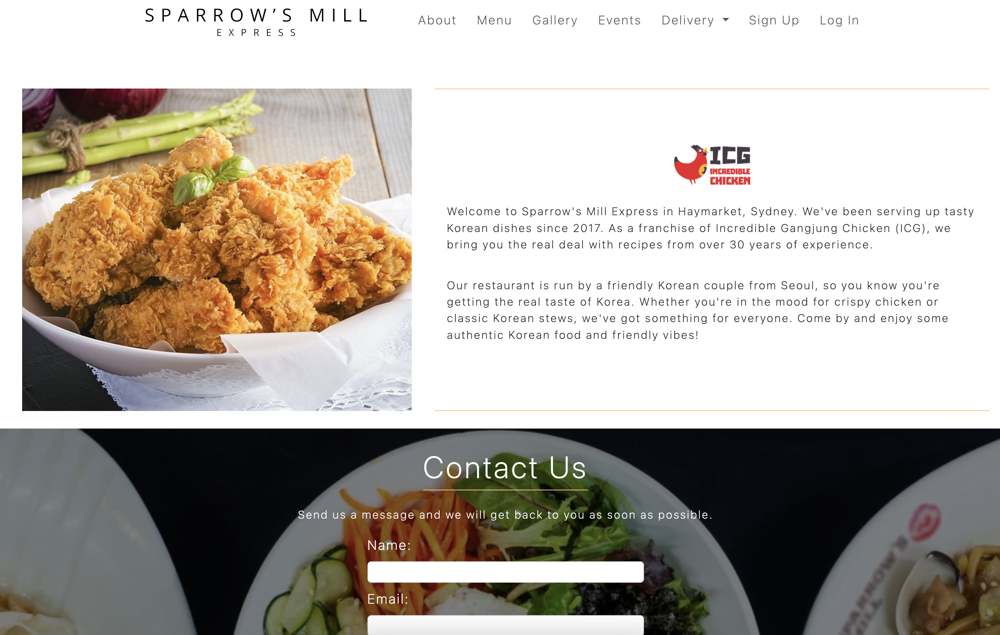

# Sparrow's Mill Express

This is a website for my parent's restaurant in the city of Sydney. It contains About page, Menu page, Gallery page and staff (Superusers) can add, edit and delete menu. 

## The Website

Visit the website: [SME](https://sparrowsmillexpress.onrender.com)

## Images

    
    

## Languages and Technologies used

* Python
* Django
* Postgres
* Render
* HTML
* CSS - Bootstrap
* JavaScript

## UX / UI

I tried to make the website to look as clean as possible, allowing user to focus on the content of it. The colour scheme is white and orange, which is the similar colour to our actual restaurant.

## Next Steps

* Could add an API from city of Sydney to display events happening near by.
* Deploy on another hosting website for commercial use.
